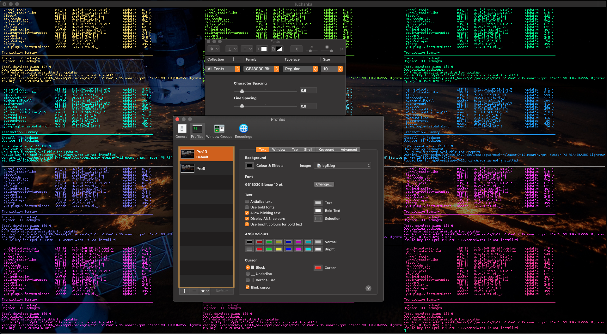

# Введение
Это прототип отказоустойчивого кластера на базе [Pacemaker](https://clusterlabs.org) и [PostgresQL](https://www.postgresql.org). [Pacemaker](https://clusterlabs.org)  официальное решение от RedHat для создания отказоустойчивых кластеров и он хорош тем, что RedHat обеспечивает его поддержку и тем, что это решение универсальное (модульное). На базе него можно будет делать отказоустойчивость не только PostgresQL, но и других сервисов, используя либо стандартные модули, либо создавая их под конкретные нужды.

Кластер разворачивается на виртуалках [VirtualBox](https://www.virtualbox.org). Всего будет развернуто 12 виртуалок (суммарно 36GiB), которые образуют 4 отказоустойчивых кластера (разные варианты). Первые два кластера состоят из двух серверов PostgreSQL, которые размещены в разных датацентрах и общего сервера *witness* c **quorum device** (размещенный на дешевой виртуалке в третьем датацентре), который разрешает неопределенность **50%/50%** отдавая свой голос одной из сторон. Третий кластер на трех датацентрах, один мастер, два раба, без  **quorum device**. Четвертый кластер состоит из четырех серверов PostgreSQL, по два на датацентр, один мастер, остальные реплики и так же использует *witness* c **quorum device**. Четвертый выдерживает отказ двух серверов или одного датацентра. Это решение может быть, при необходимости, масштабировано на большее число реплик.

Сервис точного времени [ntpd](https://www.ntp.org) тоже перенастроен для отказоустойчивости, но там используются методы самого `ntpd` (*orphan mode*). Общий сервер *witness* выполняет роль центрального ntp сервера раздавая своё время всем кластерам, тем самым синхронизируя все сервера между собой. В случае если *witness* выйдет из строя/окажется изолированным, тогда своё время начнет раздавать один из серверов кластера (внутри кластера). Вспомогательный кэширующий **http proxy** тоже поднят на *witness*, с его помощью остальные виртуалки имеют доступ к yum репозиториям. В реальности такие сервисы как точного времени и прокси наверняка будут размещены на выделенных серверах, в стенде они размещены на *witness* только для экономии количества виртуалок/места.

# Версии
0. Работает с CentOS 7 и PostgresQL 11 на VirtualBox 6.1.

# Структура кластеров
Все кластера задуманы для размещения на нескольких датацентрах, объединены в одну плоскую сеть и должны выдерживать отказ или сетевую изоляцию одного датацентра. Поэтому **невозможно** использовать для защиты от **split-brain** стандартную технологию Pacemaker, которая называется *STONITH* (Shoot The Other Node In The Head) или *fencing*. По этой технологии: если узлы в кластере начинают подозревать что-то неладное с каким-то узлом, который не отвечает или некорректно себя ведет, то они принудительно его отключают через "внешние" устройства, например управляющую карточку IPMI или UPS. Но такое сработает только в случае отказов сервера, когда при единичном отказе (сервера) считается, что IPMI или UPS продолжают работать. Здесь же планируется защита от гораздо более катастрофичного отказа, когда обесточивается или еще как перестает работать весь датацентр. А значит при таком отказе все *stonith* устройства (IPMI, UPS и т.д.) тоже не будут работать.

Вместо этого планируется работа основанная на идее кворума. Все узлы имеют голос и работать могут только те узлы, которые могут видеть больше половины всех узлов, это число "половина+1" называется **кворум**. В случае, если не так, то узел принимает решение, что он находится в сетевой изоляции и должен сам отключить на себе свои ресурсы, т.е. это такая **защита от split-brain**. На случай если сможет зависнуть/перестать работать софт, который отвечает за такое поведение, тут уже должен будет сработать watchdog, например на базе IPMI.

В случае, если число узлов четное (случай кластера на двух датацентрах), может возникнуть так называемая неопределенность **50%/50%** (*фифти-фифти*), если сетевая изоляция разрубит кластер ровно пополам. Поэтому для четного числа узлов добавляется **quorum device**, это нетребовательный демон который может быть запущен на самой дешевой виртуалке в третьем датацентре. И он дает свой голос одному из сегментов (которые видит) и тем самым разрешает неопределенность 50%/50%. Сервер на котором будет запущен quorum device я назвал *witness* (терминология из repmgr, мне понравилась).

Ресурсы могут переезжать с места на место, например, с неисправных серверов на исправные или по команде сисадминов. Чтобы клиенты знали где находятся нужные им ресурсы (куда коннектится?) используются *плавающие IP* (**float IP**). Это IP которые Pacemaker может перемещать по узлам (всё находится в плоской сети), каждый из них символизирует ресурс (сервис) и будет находится там, куда надо подключаться, чтобы получить к этому сервису (в нашем случае БД) доступ.

## Tuchanka1 (схема с уплотнением)
### Структура

Схема с уплотнением. Идея была в том, что у нас существует много мелких баз данных с низкой нагрузкой, для которых невыгодно содержать выделенный slave сервер в режиме hot standby для read only транзакций (нет необходимости в таком усложнении).

На каждом датацентре по одному серверу. На каждом сервере по два инстанса PostgresQL. (В терминологии PostgresQL они называются кластерами, но во избежания путаницы я буду их называть (по аналогии с другими БД) инстансами, а кластерами называть только кластера Pacemaker). Один инстанс работает в режиме мастера и только он оказывает услуги (только на него ведет float IP). Второй инстанс работает рабом для второго датацентра и будет оказывать услуги только если его мастер выйдет из строя. Поскольку все основное время оказывать услуги (выполнять запросы) будет только один инстанс из двух, все ресурсы сервера оптимизируются на этот инстанс (выделяется память под кэш shared\_buffers и т.д.), но так, чтобы на второй инстанс тоже хватило ресурсов (пусть и для неоптимальной работы) в случае если откажет один из датацентров. Раб не оказывает услуги (не выполняет read only запросы) при нормальной работе кластера для того, чтобы не было войны за ресурсы с мастером на той же самой машине.

В случае с двумя узлами отказоустойчивость возможна только в случае асинхронной репликации, так как при синхронной при отказе раба встанет мастер.

### Отказ witness

Отказ witness (quorum device) я рассмотрю только для кластера Tuchanka1, со всеми остальными будет та же история. При отказе witness в структуре кластера ничего не измениться и все продолжит работать точно так же, как и работало. Но кворум станет 2 из 3 и поэтому любой следующий отказ уже будет фатальным для кластера. Чинить все равно надо будет срочно.

### Отказ Tuchanka1

Отказ одного из датацентров для Tuchanka1. В этом случае witness отдает свой голос второму узлу на втором датацентре. Там бывший раб превращается в мастера, в результате на одном сервере работают оба мастера и на них указывают их оба float IP.

## Tuchanka2 (классическая)
### Структура

Классическая схема на два узла. На одном работает мастер, на втором раб. Оба могут выполнять запросы (раб только read only), поэтому на оба указывают float IP: krogan2 на мастер, krogan2s1 на раба. Отказоустойчивость будет и на мастер и на раба.

В случае с двумя узлами отказоустойчивость возможна только в случае асинхронной репликации, так как при синхронной при отказе раба встанет мастер.

### Отказ Tuchanka2

В случае отказа одного из датацентров, witness голосует за второй. На единственно оставшимся работающем датацентре будет поднят мастер и на него будет указывать оба float IP и мастерский и рабский. Разумеется инстанс должен быть настроен таким образом, чтобы у него хватило ресурсов (лимитов под connection и т.д.) одновременно принимать все подключения и запросы и от мастерского float IP и от рабского. Т.е. при нормальной работе у него должен быть достаточной запас по лимитам.

## Tuchanka4 (много рабов)
### Структура

Это уже другая крайность. Бывают БД на которые идет очень много запросов read-only (типичный случай высоконагруженного сайта). Tuchanka4 это тот случай когда таких рабов может быть 3 или больше, но все же не слишком много. При очень большом количестве рабов уже надо будет изобретать иерархическую систему реплицирования. В минимальном случае (что на картинке) в каждом из двух датацентров по два сервера, на каждом из которых по инстансу PostgresQL.

Еще одной особенностью этой схемы является то, что здесь уже можно позволить сделать 1 синхронную репликацию, она настроена таким образом, чтобы синхронная репликация по возможности шла на другой датацентр, а не на реплику в том же датацентре, где и мастер. На мастер и каждый раб указывает float IP. По хорошему между рабами надо будет делать балансировку запросов каким-нибудь *sql proxy*, например, на стороне клиента. Разному типу клиентов может требоваться разный тип *sql proxy* и только разработчики клиентов знают, кому какой нужен, эта функциональность может быть реализована как внешним демоном, так и библиотекой клиента и т.д. Все это вне темы отказоустойчивого кластера БД. (Отказоустойчивость *SQL proxy* можно будет делать независимо, вместе с отказоустойчивостью клиента.)


### Отказ Tuchanka4

В случае отказа одного датацентра (т.е. двух серверов), witness голосует за второй. В результате на втором работают два сервера, на одном работает мастер и на него указывает мастерский float IP (для приема read-write запросов). На втором работает раб с синхронной репликацией и на него указывает один из рабских float IP (для read-only запросов).

Первое, что надо отметить, что рабочими рабские float IP будут не все, а только один. И для того, чтобы с ним корректно работать нужно будет чтобы либо *sql proxy* перенаправляло все запросы на единственно оставшийся float IP, либо, если *sql proxy* нет, можно просто перечислить все  float IP рабов через запятую в URL для подключения. В случае *libpq* подключение будет к первому рабочему, именно так сделано в системе автоматического тестирования. (Возможно в случае других библиотек, например JDBC, так работать не будет и *sql proxy* будет обязателен). Все это сделано потому, что у float IP для рабов стоит запрет одновременно подниматься на одном сервере, чтобы они равномерно распределялись по рабским серверам, когда их работает несколько.

Второе, даже в случае отказа датацентра будет сохраняться синхронная репликация. И поэтому даже если произойдёт вторичный отказ, т.е. на оставшемся датацентре выйдет из строя один из двух серверов, кластер хоть и перестанет оказывать услуги, но все же сохранит информацию обо всех закоммиченных транзакциях, на которые он дал подтверждение о коммите (не будет потери информации).

## Tuchanka3 (3 датацентра)
### Структура

Это кластер на случай когда есть три полноценно работающих датацентра, на каждом из которых есть полноценно работающий сервер БД. В этом случае quorum device (сервер witness) не нужен. На одном датацентре работает мастер, на двух других рабы. Репликация синхронная типа ANY (slave1, slave2), т.е. подтверждение о коммите клиенту будет если любой из рабов первым ответит, что он коммит принял. На ресурсы указывает один float IP для мастера и 2 для рабов, в отличии от Tuchanka4 все 3 float IP отказоустойчивы. Для балансировки read-only sql запросов можно использовать *sql proxy* (с отдельной отказоустойчивостью), либо половине клиентов назначить один рабский float IP, другой половине второй.

### Отказ Tuchanka3

При отказе одного из датацентров, остаются два. На одном поднят мастер и float IP от мастера, на втором раб и оба рабских float IP (должен быть двукратный запас по ресурсам на инстансе, чтобы принять все подключения с обоих рабских float IP). Между мастеров и рабом синхронная репликация. Так же кластер сохранит информацию об закоммиченных и подтвержденных транзакциях (не будет потери информации) в случае уничтожения двух датацентров (при условии, если их уничтожение произошло не одновременно, при втором отказе).

# Список файлов
#### README.md
Этот файл, краткое описание всего.

#### HAPgSQLStructure.key
Картинки для презентации. Открывается в Keynote.app (презентации под MacOS).

#### images/
Папка, где хранятся картинки, например используются в *README.md*.

#### setup/
Bash скрипты для создания и удаления виртуалок.

#### upload/
Там лежат файлы предназначенные для заливки на виртуалки.

#### upload/common/
Файлы общие для всех виртуалок.

#### upload/pcs/
Шелловские скрипты, запускаться будут на виртуалках, содержат команды для `pcs`, которые настраивают конфигурацию кластера.

#### test/
Скрипты которыми я тестировал кластер.

#### lib/
Библиотечка функций на *bash*, используются различными скриптами.

#### default\_config.bash load\_config.bash
По умолчанию используется конфиг *default_config.bash* из git: рабочий и достаточный. Но если в конфиг надо внести изменения, то надо скопировать *default_config.bash* в *config.bash* и его уже править. Но конфиг влияет только на bash скрипты, которые выполняются на хосте. На файлы, которые лежат в upload и копируются на виртуалки, он не влияет. Поэтому, если вносятся изменения в *config.bash*, то надо будет вносить соответствующие изменения и в файлы в *upload/*. *load\_config.bash* функция используется всеми скриптами: загружает *config.bash*, если есть, если нет, то *default_config.bash*. Поскольку местоположение папки с библиотечными функциями задается в конфиге, то скрипт по загрузке конфига вынужден положить в корень.

#### power\_on power\_off shut\_down
Создал для собственного удобства, для того чтобы можно было запускать/останавливать виртуалки не запуская GUI VirtualBox. Могут в качестве параметра принимать номера кластеров, если параметров нет, то работают со всеми. Например, чтобы запустить виртуалки Tuchanka2 вместе с witness (где quorum device), достаточно написать `./power_on 0 2`. Сам Pacemaker кластер при этом не стартует, его можно будет запустить вручную, [ниже написано как](#ручное-тестирование).

#### tmux\_ssh
Запускает tmux сервер и осуществляет ssh ко всем 12ти виртуалкам. Полезен для массовых манипуляций над виртуалками со стороны юзера. Для того чтобы набирать команды одновременно на всех виртуалках сразу, можно воспользоваться фичей tmux: *Ctrl-b :* `set synchronize-panes on`. Задуман для использования совместно с вышеописанными скриптами: `power_on` и т.д. И точно так же можно в качестве параметров указывать номера кластеров (групп виртуалок). Используется выделенный tmux сервер, поэтому его можно запускать из под default tmux. Но используемый выделенный tmux сервер одинаков для `tmux_ssh` и скриптов в *setup/* и *test/*, поэтому совместно с теми скриптами этот лучше не запускать, будет конфликт.

#### etc\_hosts ssh\_config ssh\_known\_hosts
Создаются скриптом `setup/create` при создании виртуалок, используются остальными скриптами. В них соответственно: *etc_hosts* список ip и имен виртуалок в формате подходящем для вставки в */etc/hosts* (копируется в виртуалки), *ssh_config* скрипты используют этот конфиг для ssh коннектов к виртуалкам, *ssh_known_hosts* список публичных ключей виртуалок.

# Настройка терминала
Что при создании и настройке виртуалок, что автоматическом тестирование работа распараллеина. Окно терминала будет разбито с помощью *tmux* на несколько панелей, в каждом из которых будет отображаться выход своего потока, отвечающего либо за настройку виртуалки, либо кластера. Поскольку панелей будет много, желательно на терминале иметь шрифт поменьше, а экран (окно терминала) побольше. Привожу пример настройки шрифта Terminal.app для экрана Retina MacBook Pro, 16 inch, 2019.


А вот пример настройки шрифта для экрана Full HD 1920\*1080.


На случай если предпочитаете использовать *iTerm*. Скрипт автоматического тестирования `test/failure` (и быть может другие) создают такую нагрузку для *iTerm*, что начинают тормозить все окна *iTerm*. Это затрудняет параллельную работу юзера. Поэтому настойчиво рекомендую запускать скрипты из этого проекта в *Terminal.app*, а самому можно работать в *iTerm*.

# Установка
**Важное замечение владельцам MacOS. MacOS Catalina 10.15.6 (19G73) содержит баг, который приводит к утечке памяти из ядра OS при работе с виртуалками, что приводит к зависаниям и выключениям MacOS при длительной работе. Настойчиво рекомендую обновить до macOS Catalina 10.15.6 (19G2021). Полную версию MacOS можно увидеть в "Об этом Mac"->"Отчет о системе"->"ПО".**

На хосте (MacBook) нужно поставить VirtualBox. Версия VirtualBox 6.0.24 ([нестабильна](https://www.virtualbox.org/ticket/19370) и иногда не поднимается virtio-net при загрузке). Проблемы проявляются при тестировании, использовать не рекомендую. VirtualBox 6.1.12 [наблюдал ошибку bad\_alloc при создании скриншотов](https://www.virtualbox.org/ticket/19812), на тестировании не должно сказаться, но могут быть проблемы при развертывании, в этом случае достаточно будет перезапустить соответствующий этап развертывания. Для работы скриптов используется bash версии 3 и ssh (в случае MacOS они идут в комплекте), так же надо установить, например через HomeBrew: PostgresQL >=11 (для psql) и tmux (тестировал с 3.1b).

Почти у всех виртуалок, кроме *witness*, отсутствует выход в интернет, у них только один интерфейс в виртуальной подсетке, где они осуществляют связь между собой. Только в сервере *witness* два сетевых интерфейса, один во внутренней подсетке, второй для выхода в интернет. *Witness* обеспечивает остальные сервера доступом к yum репозиториям, через кэширующий http proxy, и точным временем.

Для моего удобства процесс развертывания автоматизирован, в том числе скрипты автоматический запускают команды *VBoxManager* такие как: создание снэпшотов файловой системы, запуск и остановка виртуалок. Поскольку процесс инсталляции с образа DVD и доустановка пакетов по сети занимает довольно длительное время, весь процесс установки осуществляется тремя этапами, их подробно опишу ниже, в конце каждого этапа автоматический создается снэпшот, на случай если в следующем этапе что-то пойдет не так. А в начале этапа автоматический переходит на снэпшот предыдущего этапа. И все скрипты объединены в цепочку. Например, если запустить `create` (создание виртуалок), то он в конце своей работы сам запустит скрипт `install` (установка софта), а тот в конце своей работы скрипт `setup` (настройка софта и кластеров Pacemaker).

**Все виртуалки в сумме занимают достаточно большое количество ОЗУ, на MacBook Pro 16GiB хватает впритирку. По процессорам то же самое, при полной нагрузке виртуалки заберут 12 из 12 ядер (по 2 ядра на виртуалку с 50% ограничением). Рекомендую закрывать ненужные программы. Поскольку процесс установки и тестирования может занимать достаточно длительное время, настойчиво рекомендую в настройках MacOS отключить переход в спящий режим при выключении экрана.**

Процесс установки **иногда может не завершиться**, чаще всего сбои происходят на этапе 'install' (установка пакетов). Не всегда понятно, с чем это может быть связанно, может быть нехватка ресурсов или производительности, могут быть сетевые проблемы. Для возобновления установки можно перезапустить этап, на котором был сбой.

Все команды для шелла даны для `bash`.

## Создание виртуальных машин

Создаются виртуальные машины и устанавливаются пакеты командой:

	setup/create <redhat_installation_image.iso> <root_ssh_public_key.pub>

Загрузочный диск должен быть от редхатоподобного дистрибутива 7й версии. Я использовал `CentOS-7-x86_64-Minimal-2003.iso`. Не должно быть **'** в публичном ключе (он там может быть только в комментариях). И **если приватный ключ от этого публичного ключа защищен паролем, он должен быть добавлен в keychain**, например с помощью `ssh-add -K`. Ключи загружаются при выполнении скриптов с помощью `ssh-add -A`, эту команду можно изменить в конфиге, например, для того чтобы загружать конкретный ключ, а не все, или чтобы не искать пароль в keychain. Скрипт делает:
- Удаляет виртуалки и файлы предыдущей работы, если они есть.
- Создает вспомогательные конфигурационные файлы (типа etc\_hosts, ssh\_config, etc), которые используются в дальнейших этапах.
- Настраивает общую подсетку в VirtualBox.
- В цикле создает и запускает headless все 12 виртуалок: 2 ядра, 600MiB ОЗУ, 3GiB виртуальный диск.
- Устанавливает на них Linux из указанного образа: один раздел винчестера, без swap. Переключение раскладок клавиатуры на **Ctrl-Shift**, пароль у root *"changeme"* (полезен на случай захода через консоль). Хоть и будет надпись, что создаётся еще пользователь vboxuser, он не создаётся. При инсталляции записывается публичный ключ root'а для ssh (тот что указан вторым аргументом).
- Запускает, записывает ssh публичный ключ виртуалок на хост.
- Отключает kdump (экономлю ресурсы).
- Устанавливает русскую локаль (с английским `LC_MESSAGES`).
- Выключает виртуалки и делает снэпшот *create*.
- Запускает следующий скрипт.

Поскольку большая часть работы проходит внутри виртуалок с выводом только в их консоль, то наблюдать за процессом в окне терминалки мало пользы, там большей частью будет цикл ожидания. Чтобы было интереснее, можно запустить GUI VirtualBox и там наблюдать за процессом на экранах консолей.


Время выполнения 18 минуты на MacBook Pro. Обратный скрипт `setup/destroy_vms` (удаляет виртуалки). И чтобы откатиться на момент завершения скрипта `create` скрипт `setup/rollback2create`.

## Установка пакетов

- Откатывает к снэпшоту `create`.
- Настраивает **http proxy** на *witness*.
- Устанавливает/обновляет пакеты.
- Выключает виртуалки и делает снэпшот *install*.
- Запускает следующий скрипт.

Время выполнения 19 минуты на MacBook Pro, время выполнения сильно зависит от количества пакетов требующих обновления. Обратный скрипт `setup/rollback2create`. И чтобы откатиться на момент завершения скрипта `install` скрипт `setup/rollback2install`.

## Настройка Pacemaker и установка БД heartbeat

Скрипт `setup/setup`:
- Откатывает к снэпшоту `install`.
- Копирует на все виртуалки нужные файлы.
- Настраивает ntpd, для устойчивой работы при сетевой изоляции, например, на случай изолированного стенда на ноутах.
- На всех запускает pcsd (REST демон для `pcs`), редхатовская управлялка Pacemaker.
- На *witness* запускает кворум девайс.
- Создает в Pacemaker четыре кластера, проводит первичную настройку.
- Создает 5 инстансов PostgresQL, в первом инстансе 2 БД, в остальных по одной.
- PAF модуль (pgsqlms) требует, чтобы до запуска через Pacemaker, PostgresQL был запущен в ручном режиме с установившейся репликацией.
- В Pacemaker создает ресурсы в соответствии к созданным БД, прописывает для них плавающие IP.
- Ждет появления пинга на плавающий IP мастера (как критерий, что кластер встал).
- Создает *heartbeat* пользователя и БД.
- Выключает кластера, виртуалки, делает снэпшот *setup*.

Время выполнения 6 минуты на MacBook Pro. Обратный скрипт `setup/rollback2install`. И чтобы откатиться на момент завершения скрипта `setup` скрипт `setup/rollback2setup`.

# Конфиги на хосте
Для удобства своей работы, я внес следующие изменения в конфигах на хосте.

#### /etc/hosts
Добавил строчки:

# Tuchanka
	192.168.89.1	witness witness.tuchanka
	192.168.89.11	tuchanka1a tuchanka1a.tuchanka
	192.168.89.12	tuchanka1b tuchanka1b.tuchanka
	192.168.89.21	tuchanka2a tuchanka2a.tuchanka
	192.168.89.22	tuchanka2b tuchanka2b.tuchanka
	192.168.89.31	tuchanka3a tuchanka3a.tuchanka
	192.168.89.32	tuchanka3b tuchanka3b.tuchanka
	192.168.89.33	tuchanka3c tuchanka3c.tuchanka
	192.168.89.41	tuchanka4a tuchanka4a.tuchanka
	192.168.89.42	tuchanka4b tuchanka4b.tuchanka
	192.168.89.43	tuchanka4c tuchanka4c.tuchanka
	192.168.89.44	tuchanka4d tuchanka4d.tuchanka
	192.168.89.15	krogan1a krogan1a.tuchanka
	192.168.89.16	krogan1b krogan1b.tuchanka
	192.168.89.25	krogan2 krogan2.tuchanka
	192.168.89.26	krogan2s1 krogan2s1.tuchanka
	192.168.89.35	krogan3 krogan3.tuchanka
	192.168.89.36	krogan3s1 krogan3s1.tuchanka
	192.168.89.37	krogan3s2 krogan3s2.tuchanka
	192.168.89.45	krogan4 krogan4.tuchanka
	192.168.89.46	krogan4s1 krogan4s1.tuchanka
	192.168.89.47	krogan4s2 krogan4s2.tuchanka
	192.168.89.48	krogan4s3 krogan4s3.tuchanka
	192.168.89.254	virtualbox

#### ~/.ssh/config
Добавил строчки:

	#	Tuchanka
	Host witness
		HostName 192.168.89.1
	Host tuchanka1a
		HostName 192.168.89.11
	Host tuchanka1b
		HostName 192.168.89.12
	Host tuchanka2a
		HostName 192.168.89.21
	Host tuchanka2b
		HostName 192.168.89.22
	Host tuchanka3a
		HostName 192.168.89.31
	Host tuchanka3b
		HostName 192.168.89.32
	Host tuchanka3c
		HostName 192.168.89.33
	Host tuchanka4a
		HostName 192.168.89.41
	Host tuchanka4b
		HostName 192.168.89.42
	Host tuchanka4c
		HostName 192.168.89.43
	Host tuchanka4d
		HostName 192.168.89.44
	Host witness tuchanka1a tuchanka1b tuchanka2a tuchanka2b tuchanka3a tuchanka3b tuchanka3c tuchanka4a tuchanka4b tuchanka4c tuchanka4d
		ForwardAgent yes
		ForwardX11 no
		AddKeysToAgent yes
		AddressFamily inet
		BindAddress 192.168.89.254
		CanonicalizeHostname no
		CheckHostIP yes
		Compression no
		HashKnownHosts no
		StrictHostKeyChecking yes
		TCPKeepAlive yes
		ServerAliveInterval 5
		User root
		UserKnownHostsFile "/Users/!my_user!/prog/DomClick/tuchanka /ssh_known_hosts"

В последнюю строку надо будет прописать реальный путь к файлу (файл создается при первом запуске `create`).

# Система автоматического тестирования
Для проверки отказоустойчивости кластеров при имитации различных неисправностей сделана система автоматического тестирования. Запускается скриптом `test/failure`. Скрипт может принимать параметрами номера кластеров, которые хочется потестировать, например здесь:
```
test/failure 2 3
```
будет тестировать только 2й и 3й кластер. Если параметры не указаны, то все. Все кластера тестируются параллельно, результат выводится в панели tmux. Tmux использует выделенный сервер, поэтому скрипт можно запускать из под default tmux, получится вложенный tmux. Рекомендуется терминал в большом окне и с малым шрифтом, настроенный так, как [было описано выше](#настройка-терминала). Перед началом тестирования все виртуалки откатываются на снэпшот на момент завершения скрипта `setup`.


Терминал разбит на число колонок равное числу тестируемых кластеров, по умолчанию (на скриншоте) четыре колонки - тестируются 4 кластера. Что внутри колонок - распишу на примере Tuchanka2. Панели на скриншоте пронумерованы:
1. Здесь выводится статистика по тестам. Колонки:
	- **failure** - название теста (функции в скрипте) которая эмулирует неисправность.
	- **reaction** - среднее арифметическое время в секундах за которое кластер восстановил свою работоспособность. Замеряется от начала работы скрипта эмулирующего неисправность и до момента, когда кластер восстанавливает свою работоспособность и будет способен продолжать оказывать услуги. Если время очень маленькое, например 6 секунд, такое бывает на кластерах где есть несколько рабов (Tuchanka3 и Tuchanka4) это значит, что неисправность оказалась на асинхронном рабе и никак не повлияла на работоспособность, переключений состояния кластера не было.
	- **deviation** - показывает разброс (точность) значения **reaction** методом "стандартная девиация".
	- **count** - сколько раз был выполнен этот тест.
2. Краткий лог позволяет оценить, чем занимается кластер в текущий момент. Выводится номер итерации (теста), временная метка и название операции. Слишком долгое выполнение (>5 минут) говорит о том, что что-то пошло не так.
3. **heart** (сердце) - текущее время. Для визуальной оценки работоспособности *мастера* в его таблицу постоянно пишется текущее время, используется float IP мастера. В случае успеха результат выводится в этой панели.
4. **beat**  (пульс) - "текущее время", которое ранее было записано скриптом **heart** в мастер, теперь считывается из *раба* через его float IP. Позволяет визуально оценить работоспособность раба и репликации. В Tuchanka1 нет рабов с float IP (нет рабов оказывающих услуги), но зато там два инстанса (БД), поэтому в Tuchanka1 здесь будет показываться не **beat**, а **heart** со второго инстанса.
5. Мониторинг состояние кластера утилитой `pcs mon`. Показывает структуру, распределение ресурсов по узлам и другую полезную информацию.
6. Две панели, циферка про обе. Здесь выводится системный мониторинг с каждой виртуалки кластера. Таких панелей может быть и больше, столько, сколько виртуалок у кластера. Два графика *CPU Load* (в виртуалках по два процессора), имя виртуалки, *System Load* (названый как Load average, потому что он усреднен за 5,10,15 минут), данные по процессам и распределение памяти.
7. Трассировка скрипта осуществляющего тестирования, нужна для отладки. В случае неисправности: внезапного прерывания работы либо бесконечного цикла ожидания здесь можно будет увидеть причину такого поведения.

Тестирование проводится в два этапа. В первом этапе скрипт проходит по всем разновидностям тестов, случайным образом выбирая виртуалку, к которой этот тест применить. Второй этап - выполняется бесконечный цикл, тест и виртуалка каждый раз выбираются случайным образом. Внезапное завершение скрипта тестирования (нижняя панель) или бесконечный цикл ожидания чего-либо (слишком долгое >5 минут время выполнения одной операции, в трассировке виден цикл ожидания) говорит о том, что какой-то из тестов на этом кластере провалился.

Каждый тест состоит из следующих операций:
1. Запуск функции эмулирующей неисправность.
2. **Ready?** - ожидание возвращения кластеру работоспособного состояния (когда оказываются все услуги).
3. Показывается время ожидания восстановления кластера (*reaction*).
4. **Fix** - кластер "чинится". После чего он должен вернуться в полностью работоспособное состояние и готов к следующей неисправности.

Вот список тестов с описанием, что они делают:
- **ForkBomb**: создает "Out of memory" с помощью форк бомбы.
- **OutOfSpace**: переполняет винчестер. Но тест скорее символичный, при той незначительной нагрузке, которая происходит при тестировании, при переполнении винчестера отказа работы PostgresQL обычно не происходит.
- **Postgres-KILL**: убивает постгрес командой `killall -KILL postgres`.
- **Postgres-STOP**: подвешивает постгрес командой `killall -STOP postgres`.
- **PowerOff**: "обесточивает" виртуалку командой `VBoxManage controlvm "виртуалка" poweroff`.
- **Reset**: перегружает виртуалку командой `VBoxManage controlvm "виртуалка" reset`.
- **SBD-STOP**: подвешивает демон SBD командой `killall -STOP sbd`.
- **ShutDown**: через ssh посылает на виртуалку команду `systemctl poweroff`, система корректно завершает работу.
- **UnLink**: сетевая изоляция, команда `VBoxManage controlvm "виртуалка" setlinkstate1 off`.

Завершение тестирование либо с помощью стандартной командой tmux "kill-window" **Ctrl-b &**, либо командой "detach-client" **Ctrl-b d**: при этом тестирование завершается, tmux закрывается и выключаются виртуалки.

# Ручное тестирование
Переключение раскладок клавиатуры на виртуалках (в виртуальных консолях) **Ctrl-Shift**, пароль у root "**changeme**" (полезен на случай захода через консоль). Но удобнее работать через `ssh` с аутентификацией через уже записанным в виртуалки скриптом `create` публичным ключом.

Поскольку все виртуалки объединены в группы, согласно кластерам, запускать и останавливать группу в приложении VirtualBox можно через правую кнопку мыши на имени группы(кластера). Запускать либо целиком группу *Tuchanka*, либо запуская *Tuchanka0* (общие сервисы) и нужную подгруппу, например *Tuchanka1*. Либо скриптом `./power_on`, например аналогично для тестирования первого кластера `power_on 0 1`. После этого зайти на любую машину нужного кластера и выполнить команду поднимающую кластер:

	pcs cluster start --all

Кластер автоматический не поднимается (сервер не добавляется в кластер при загрузке) потому, что, по идее, если машина перегрузилась или включилась, то сисадмин должен найти причину, устранить, синхронизировать БД и после этого вручную добавить машину в работающий кластер. Если бы машина добавлялась в кластер автоматический при загрузке, то тогда была бы возможна ситуация когда постоянно обнаруживается неисправность, машина постоянно перезагружается и переподключается, да еще мешает работе здоровой части кластера (могут начаться переключения и прерываться оказание услуг).

Внутри виртуалки, находящейся в кластере, состояние кластера можно мониторить скриптом `mon`, находится в /root/bin. Восстанавливать БД, после того как она рассинхронизировалась, можно скриптами типа `restore1a`, лежат в /root/bin. Файлы типа `restore1a` или `restore2` только удаляют текущую директорию БД и копируют БД с текущего мастера. А файлы `restore` (созданы только для тестового стенда) выполняют рутинную работу при тестировании: запускают файл типа `restore1a`, добавляют ноду в кластер `pcs cluster start` и удаляют сообщения о старых ошибках из кластера `pcs resource cleanup`. В продакшине использовать такие скрипты считаю нецелесообразным, т.к. если причина отказа работы сервера неизвестна, то сисадмин должен контролировать каждый шаг.

## Отключение всех машин в кластере
Жесткое отключение - на заголовке группы и на witness *Close/Power Off*. Или скриптом `power_off`.

# Выявленные при тестировании проблемы
- На текущий момент *watchdog демон* *sbd* отрабатывает остановку наблюдаемых демонов, но не их зависание. И, как следствие, некорректно отрабатываются неисправности приводящие к зависанию только *Corosync* и *Pacemaker*, но при этом не подвешивающие *sbd*. Для проверки *Corosync* уже есть [**PR#83** (в GitHub у *sbd*)](https://github.com/ClusterLabs/sbd/pull/83) принят в ветку *master*. Обещали (в PR#83), что и для Pacemaker будет что-то подобное, надеюсь, что к *RedHat 8* сделают. Но подобные "неисправности" умозрительные, легко имитируется искусственно с помощью, например `killall -STOP corosync`, но никогда не встречались естественно.

- У *Pacemaker* в версии для *CentOS 7* неправильно выставлен *sync\_timeout* у *quorum device*, в результате [при отказе одного узла с некоторой вероятностью перезагружался и второй узел](https://lists.clusterlabs.org/pipermail/users/2019-August/026145.html), на который должен был переехать мастер. Вылечилось увеличением *sync\_timeout* у *quorum device* во время развертывания (в скрипте `setup/setup1`). Эта поправка не была принята разработчиками *Pacemaker*, вместо этого они пообещали перераработать инфраструктуру таким образом (в некотором неопределенном будущем), чтобы этот таймаут вычислялся автоматический.

- В случае если при конфигурации базы данных указано, что в LC\_MESSAGES (текстовые сообщения) может использоваться юникод, например ru\_RU.UTF-8, то в случае запуска *postgres* в окружении где locale не UTF-8, например в пустом окружении (в пустом окружении *pacemaker*+*pgsqlms*(paf) запускает *postgres*), то в этом случае [в логе вместо букв UTF-8 будут знаки вопроса](https://www.postgresql.org/message-id/13FE0F7C-5140-499C-8C2E-0BE64BC3A48B%40ya.ru). Разработчики PostgreSQL так и не договорились, что делать в этом случае. Обходится, нужно ставить LC\_MESSAGES=en\_US.UTF-8 при конфигурации (создании) кластера БД.

- Изредко наблюдал подвисание репликации у PostgresQL при тесте ForkBomb (переполнение памяти). [После ForkBomb иногда слейвы могут не переподключаться к новому мастеру.](https://www.postgresql.org/message-id/60590EC6-4062-4F25-A49C-3948ED2A7D47%40ya.ru) Наблюдал это только в кластерах tuchanka3 и tuchanka4, где из-за того, что репликация синхронная, подвисал мастер. Проблема проходила сама, спустя какое-то длительное время (порядка двух часов). Требуется дополнительное исследование, для того чтобы проблему исправить.

# ToDo
Пока нет, но должно появится в следующих итерациях:
- S3 архивирование (в том числе чтобы добирать недостающие страницы при репликации)
- Централизованная аутентификация пользователей PostgreSQL (в том числе логинов для репликации?)
- Настройки для Zabbix
- Миграция БД между кластерами
- Апгрейд PostgreSQL (перенос всех БД на новый кластер)
- Общие сервисы для всех БД, например *pg_cron*.

# Лицензия
Данный проект распространяется по лицензии MIT.

> Copyright Ⓒ 2020 "Sberbank Real Estate Center" Limited Liability Company.
>
> Permission is hereby granted, free of charge, to any person obtaining
> a copy of this software and associated documentation files (the "Software"),
> to deal in the Software without restriction, including without limitation
> the rights to use, copy, modify, merge, publish, distribute, sublicense,
> and/or sell copies of the Software, and to permit persons to whom the Software
> is furnished to do so, subject to the following conditions:
>
> The above copyright notice and this permission notice shall be included in all
> copies or substantial portions of the Software.
>
> THE SOFTWARE IS PROVIDED "AS IS", WITHOUT WARRANTY OF ANY KIND,
> EXPRESS OR IMPLIED, INCLUDING BUT NOT LIMITED TO THE WARRANTIES
> OF MERCHANTABILITY, FITNESS FOR A PARTICULAR PURPOSE AND NONINFRINGEMENT.
> IN NO EVENT SHALL THE AUTHORS OR COPYRIGHT HOLDERS BE LIABLE FOR ANY CLAIM,
> DAMAGES OR OTHER LIABILITY, WHETHER IN AN ACTION OF CONTRACT, TORT OR OTHERWISE,
> ARISING FROM, OUT OF OR IN CONNECTION WITH THE SOFTWARE OR THE USE OR OTHER
> DEALINGS IN THE SOFTWARE.

Картинка крогана взята с [Deviant Art](http://fav.me/d8fo42n) c разрешения автора:

