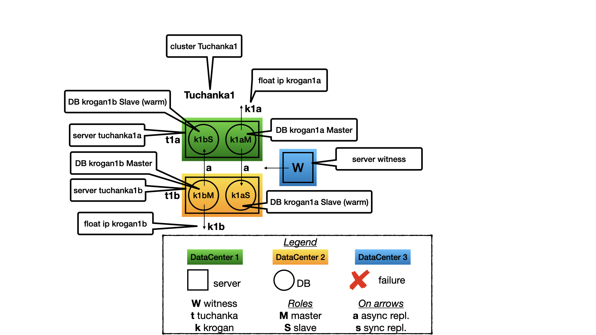
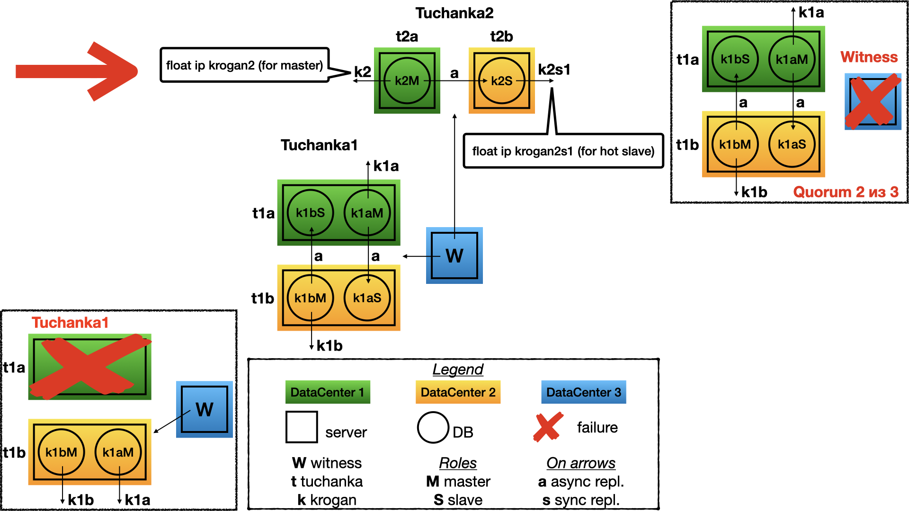
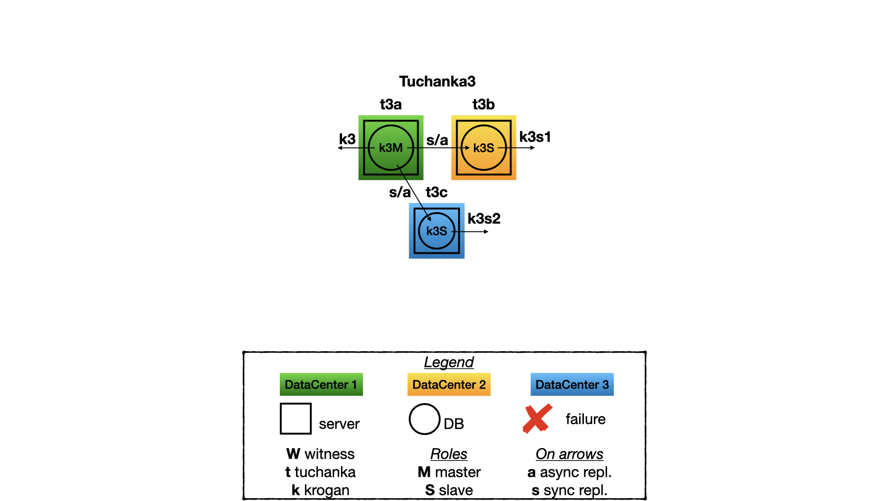

# Introduction
Some time ago I got a task to develop a high available [PostgreSQL](https://www.postgresql.org) cluster. It must works on several data centres inside one city united by optical fiber. And it must survive a failure (for instance power off) one of the data centres. [Pacemaker](https://clusterlabs.org) was chosen as high availability software, because it is an official solution from RedHat for high available clusters and so it is supported by RedHat. Also it is good because this is a universal modular solution and can be used not only for PostgreSQL, but for other services too, by using its standard modules or a specific module can be created for specific needs.


There is a question: how highly available will be such high available cluster? To research this was developed a test bed, which imitates failures of a cluster node, waits for recovery, fixes failed node and cyclically continue testing. At first time this project was called "HAPgSQL". But with time I was bored with name where only one vowel. So I named high available databases (and float IPs pointing to them) of this project as **krogan** (this is fantastic creatures with duplicated organs). And nodes, clusters and project itself I named as **tuchanka** (this is a planet of krogans).


The test bed is deployed on virtual machines (VMs) of [VirtualBox](https://www.virtualbox.org). Totally there will be 12 VMs which will occupy 36GiB of hard disk. They will form 4 high available clusters (different variants). First two clusters consisted of two nodes will be placed on two different data centres and a common server *witness* with **quorum device** will be placed on very cheap VM in the third data center. *Witness* will solve uncertainty **50%/50%** by giving its voice to one of the side. The third cluster will occupy three data centres: one for a master and two for slaves. It will not use the **quorum device**. Fourth cluster will consists of four nodes, two nodes will be per data centre: one will be a master and three other will be slaves. It will also use the *witness* with the **quorum device**. The fourth cluster will survive failing of two nodes or one data centre. The fourth cluster can be scaled for more number of nodes if this will be needed.

Network Time Protocol daemon [ntpd](https://www.ntp.org) also reconfigured for high availability. There is used a method of `ntp` itself (*orphan mode*). The common server *witness* is a central NTP-server. It is share its precise time to the clusters and synchronise all nodes with each other. If *witness* will be failed or will be isolated, then one node in the each cluster will begin share its time inside the cluster. Also an auxiliary cache **HTTP proxy** is risen on the *witness*. With the aid of the *HTTP proxy* other VMs have access to the Yum-repositories. In the real life such services as NTP or HTTP proxy probably will be placed on a dedicated servers, but in this test bed the auxiliary services are placed on the one server *witness* to save space and to reduce number of VMs.

This test bed can be used to test high available features of the clusters based on PostgreSQL and Pacemaker. A list of discovered bugs you will see below. And it can be used for presentations, all is run on a single MacBook Pro. I think this is much better instead of showing screenshots or video to show how the high available clusters survive different faults in the real time.

# Versions
0. Works with CentOS 7 and PostgreSQL 11 on VirtualBox 6.1.

# Structure of the clusters
There is a standard technology of Pacemaker to protect from the **split-brain**. It is named *STONITH* (Shoot The Other Node In The Head) or *fencing*. The purpose of *STONITH* is simple: when nodes of the cluster begin suspect that there is something wrong with one of the node (it does not respond or incorrectly behave), they will turn off power on this node by using IPMI or UPS. This is working well when whole cluster placed inside one data-centre and when happens a failure with a server, IPMI or UPS is continue working. But all clusters was designed to be placed on several data-centres. It must survive a much more catastrophic scenario: a failure or a net isolation of one data-centre. So this is **impossible** to use *STONITH*, because in the case of this scenario all *stonith* devices (IPMI, UPS, etc) will not work too.

Instead to protect from a **split-brain** used other technique called **quorum**. All nodes has a voice and may work only those nodes, who can listen voices from the more than half number of nodes in the cluster. This number equal to "half+1" is also called **quorum**. If a node don't see the quorum, then it decides that it is in a net isolation and must turn its services off, this is a protection from the **split-brain**. If the software that answers for such behaviour is failed, then must fire a watchdog (for instance IPMI based) and turn off the node.

In the case of even nodes (a cluster on two data-centres) there may be risen uncertainty **50%/50%** (*fifty-fifty*), when a net isolation will split the cluster into equal parts. So for the case of even nodes must be added so called **quorum device**. It is a small daemon which may run on a cheapest VM in a third data-centre. It will give its voice to one of the split segments (which it can observe) and thus uncertainty **50%/50%** will be resolved. The server with  **quorum device** I call **witness** (this term was taken from [RepMgr](https://repmgr.org)).

A services may travel from a node to a node, for instance from a failed node to worked or by a sysadmin command. So to direct a client of a service to the right node to connect to the service **float IP** is used. This is IP that Pacemaker can move between nodes of a cluster (the cluster is inside a flat net). Each *float IP* symbolise an service and it will be on a node to where clients must connect to get access to this service (DB, for instance).

## Tuchanka1 (schema with compression)
### Structure

This cluster is designed for the case of many small databases with low load. In such case is unprofitable to keep a dedicated slave server as a hot standby for read-only transactions. Each data-centres have one server. On each server there are two instance of PostgreSQL. (In documentation of PostgreSQL an instance is called a cluster, but to prevent confusion I will call it an instance, while a cluster I will use only for a Pacemaker clusters.) One instance on the server works as a master, while the another is a slave for the secondary server.

Only a master performs services, so a float IP points only to a master. The slave does not perform service in time of normal working of data-centre to prevent fighting with the master for the resources on the same server. The slave will perform services only after failing of its master and promoting to a master itself. The most time only one instance in a server will perform service, so all resources of the server may be optimised only for it (shared_buffers, etc). But there must be enough reserve for the slave instance in time of failing the secondary data-centre (may be for none optimal work mostly through the cache of OS file system).

In the case of two nodes only an async replication is possible for HA, because with a sync replication failing of a slave will lead to stopping the master. But **with async replication confirmed committed transactions may be loosed after failing a master**.

### Witness fault

Failing of witness I will demonstrate only for the cluster Tuchanka1. With other clusters it will be the same story. Nothing will be changed in the structure of the cluster after failing of the witness. All will work as usual. But quorum will be 2 of 3 and thus any one more failing will be catastrophic. So witness must be repaired as fast as possible too.

### Tuchanka1 fault

This is failing of one of the data-centres of Tuchanka1. In this case *witness* will give its voice to the node on the second data-centre. Here a former slave will promote to a master. Thus on one server will be two masters and both float IP will point on them.

## Tuchanka2 (classic)
### Structure

This is a classic schema of two nodes. A master exists on the first node, the slave is on second. Both can perform queries (slave read only). So both are pointed by float IP: krogan2 points on the master, krogan2s1 points on the slave. High availability will be for the both float IPs.

In the case of two nodes only an async replication is possible for HA, because with a sync replication failing of a slave will lead to stopping the master. But **with async replication confirmed committed transactions may be loosed after failing a master**.

### Tuchanka2 fault

After failing one of the data-centres the *witness* will vote for the second. On the one working server will be the master. Both float IP (master and slave) will point on it. Sure, the instance of PostgreSQL must be configured and have enough resources (connection limit, etc) to get all connection from the master and slave float IP simultaneously.

## Tuchanka4 (many slaves)
### Structure

This is another edge. This is for databases with high load of read only queries (typical case of high loaded web site). Tuchanka4 is a situation, when the slaves may be three or more, but not too many. With a lot of slaves a hierarchical replication schema must be used. In minimal case (as on the picture) there are two servers in each of two data-centres. There is one instance of PostgreSQL in the each server.

One of the advantage of this schema is here can be used a sync replication. The sync replication designed to do replication to other data-centre, if this is possible. Float IPs point on the master and the all slaves. It will be good to balance loading between slaves in some way, for instance by *sql proxy* on the client side, because different clients may be need different *SQL proxy* or different configuration of a *SQL proxy* and only developers of client know how perfectly configure *SQL proxy* for their needs. This functionality can be achieved by a real *sql proxy* daemon, or by connection pool inside library, etc. All this question is out of matter of a HA cluster. HA of the *SQL proxy* can be designed with HA of clients, independently from the HA cluster.

### Tuchanka4 fault

Fault of the one data-centre will mean fault of the two servers. The witness will vote for the other data-centre. As result on the second data-centre will work two servers. The one is for the master and it will be pointed by the master float IP to get read-write queries. The second is for a slave with the sync replication, it will be pointed be one of the slave float IP to get read only queries.

First notice: only one of the slave float IP will work, but not all. This is because in this schema the slave float IP designed to be risen only on different servers. So a *SQL proxy* will may direct all connection to only the one live float IP, but not exceed the connection limits of the node. There is a simple way without a *SQL proxy*, this can be also achieved by using a feature of *libpq*, all the slave float IPs can be written in the same URL as comma separated list. In this case *libpq* will connect to the first working IP from the list. This technique is used in this automatic test system, but may be not appropriate for the production system, because it can not guarantee not exceeding the connection limit of the node.

Second notice: even after fault of one of the data-centres the sync replication will be remain. And even after secondary fault, when in the last data-centres will fault one of the server, then the cluster will not work, but all information about confirmed committed transactions will be kept. (There will not loosing information after secondary fault).

## Tuchanka3 (3 data-centres)
### Structure

This is a case when three data-centres can be used with full power. There is one working server on each of them, a master with a float IP is on one, slaves with float IPs are on two others. In this case *quorum device* is not needed. The replication is **ANY (slave1, slave2)**. This mean that a client will get confirmation about commit when one of the two slaves will confirm that it has accepted commit. Unlike Tuchanka4, both slave float IP are high available here. To balance read-only SQL queries an *SQL proxy* may be used. Or just assign one of the slave float IPs to one half of the clients and the second to the other half of the clients.

### Tuchanka3 fault

After a fault of one of the data-centres there will be the two other working data-centres. The one of them will have the master and the master float IP. The second will have the slave and both the slave float IP. (Instance must have enough the connection limit to get all connection from the both float IP.) Between master and the last slave will be the sync replication. And even after secondary fault, when in the last data-centres will fault one of the server, then the cluster will not work, but all information about confirmed committed transactions will be kept. (There will not loosing information after secondary fault).

## Important notice
I already have written about it, but I want to emphasise. The clusters Tuchanka1 and Tuchanka2 has only two nodes and so only an async replication. Thus **confirmed committed transactions may be loosed after failing a master**. How much this is important depends on the context. One case is loosing someone text messages on a web forum. The other case if will be loosed someones money. Tuchanka3 and Tuchanka4 don't have such disadvantage.

# File list
#### README.md
This is this file, brief description of anything.

#### HAPgSQLStructure.key
Pictures for a presentation. Can be opened by Keynote.app under macOS.

#### images/
A folder for images, for instance to use in this *README.md*.

#### setup/
Bash scripts to create and destroy VMs.

#### upload/
Files to upload into VMs.

#### upload/common/
Files common for all VMs.

#### upload/pcs/
Commands for `pcs` to configure clusters.

#### test/
Scripts to test clusters.

#### lib/
Library of functions for *bash*, used by different scripts.

#### default\_config.bash load\_config.bash
By default is used the config *default_config.bash* from git. It is sufficient for working. But if you want to change the default settings then you need to copy *default_config.bash* to *config.bash* and edit the later. But the config influences only on the scripts that worked on the host, but not inside VMs. So if you have changed the default config you also need to change the corresponding settings in the files inside *upload/* dir, which will be copied into VMs. *load\_config.bash* is a function used by all scripts. It will load *config.bash* if it exists, if not then load *default_config.bash*. *load\_config.bash* is placed in the project root directory because path of the library dir will be defined inside the config itself and not known yet on this step.

#### power\_on power\_off shut\_down
I created this scripts for my convenience to start/stop VMs without launching the GUI VirtualBox. This scripts can take as option numbers of the clusters, without option they will work for all clusters. For instance, to start VMs *Tuchanka2* with *witness* (quorum device) enough `./power_on 0 2`. The Pacemaker cluster itself will not start, how to launch it [is written below](#manual-testing).

#### tmux\_ssh
Launch *tmux* and make ssh connect to all 12 VMs. Useful for mass manipulations with the VMs by the user. To perform commands on all VMs simultaneously the feature of the tmux can be used: *Ctrl-b :* `set synchronize-panes on`. Designed to use with scripts described upper: `power_on`, etc. And it also accepts as options numbers of the clusters (VMs groups). It use dedicated tmux server, so it can be used from the default tmux server. But this dedicated server is the same as for scripts used in the project, for instance, under dir *setup/* and *test/*, so it `tmux_ssh` will conflict with this scripts.


#### etc\_hosts ssh\_config ssh\_known\_hosts
This files are created by the script `setup/create` before creating VMs and used by other scripts.
- *etc_hosts* is a list of IPs and names of VMs, used to upload into VMs as */etc/hosts*.
- *ssh_config* is used by the scripts to make ssh connection to the VMs.
- *ssh_known_hosts* is a list of public keys of the VMs.

# Preferences of Terminal.app
The creation and setup of VMs and automatic tests are doing in parallel. The windows of a terminal will be split by the tmux into several panes, each pane will show output of one process. The panes will be a lot enough, so it is desirable to have a terminal with a small font and a large size of the window. Here is an example of setup Terminal.app for a display of Retina MacBook Pro, 16 inch, 2019.


And here is an example of setup of Terminal.app for a display Full HD 1920\*1080.


This is a notice if you prefer to use *iTerm.app*. The script of the automatic testing system `test/failure` (and may be others) creates too hight load for *iTerm*, so all windows of *iTerm.app* begin slow. It will impede working of the user. So I recommend launch scripts inside *Terminal.app*, while keep own working inside *iTerm.app*.

# Installation
**Important notice for users of macOS. MacOS Catalina 10.15.6 (19G73) have a bug leakage in the kernel memory when OS works with VMs. This lead to freezing and power off by a watchdog on long working. I recommend to update to macOS Catalina 10.15.6 (19G2021).** The version number of macOS your can see in "About This Mac"->"System Report..."->"Software".

The project is designed and tested on MacBook Pro, but may be it can work on other OSes. On the host (MacBook) must be installed VirtualBox. VirtualBox 6.0.24 [is unstable](https://www.virtualbox.org/ticket/19370). This problem will influence testing, so I do not recommend this version. VirtualBox 6.1.12 sometimes [has problem bad\_alloc on snapshot creation](https://www.virtualbox.org/ticket/19812). This bug will not influence testing, but sometimes it will stop the process of the installation. In this case will be enough to restart the corresponded installation stage. For the scripts to work need bash version 3 and ssh. In case of macOS they are in the default system installation. Also need to install PostgreSQL >=11 (for psql) and tmux (tested with 3.1b), for instance by using HomeBrew.

Only *witness* will have access to the internet. It has two interfaces, one for the internal network, other for Internet. All other VMs will have only one interface inside the internal network. *Witness* will provide other VMs with access to yum-repositories through caching HTTP proxy, and will provide with NTP time.

The process of the installation is automated. The scripts automatically will perform: creation VMs, creation of filesystem snapshots, start and stop VMs, etc. The whole installation consist of three stages, after each stage will be created a snapshot. And at the begin of a stage the script will load the snapshot of the previous stage. And all scripts is united in a chain. For instance if you have launched `create` (creation of VMs), this script at the end will launch the script `install` (software installation), and later `setup` (setup of software and Pacemaker clusters) will be launched.

**All VMs in sum takes enough big part of RAM. MacBook Pro 16GiB is barely enough. The same with CPU, on full load VMs will take 12 of 12 CPU kernels (2 kernel for one VM with 50% restriction). I recommend to close unnecessary programs. The installation and testing process is long enough so I recommend to turn on option "Prevent computer from sleeping automatically when the display is off" in MacBook preferences.**

The installation **sometimes may suddenly stop**. More often this happens at `install` stage (software installation). This is not obvious why this happens, may be not enough resources and productivity or may be this due to some network troubles. For resumption of installation just restart the stage, where the fault was.

All commands below is for the `bash` shell from the project root directory.

## VMs creation

The VMs are created by the command:

	setup/create <redhat_installation_image.iso> <root_ssh_public_key.pub>

The installation image must be of RedHat 7 alike distribution. I use `CentOS-7-x86_64-Minimal-2003.iso`. There must not be **'** inside the public key (it can be there only in comments). And **if the private key of this public key protected by password, it must be added into keychain**, for instance by command `ssh-add -K`. The private key are loaded into the ssh agent by command `ssh-add -A` inside the scripts. This command can be changed in the config file, for instance to load only one key, but not all. The script `setup/create` does:
- Destroy VMs and delete files created from previous attempts, if they exists.
- Create auxiliary config files (etc\_hosts, ssh\_config, etc), which will be used later.
- Create a subnet inside VirtualBox.
- Create and launch headlessly 12 VMs: 2 kernels, 600MiB RAM, 3GiB of virtual HDD.
- Install Linux from the installation image: one partition, without swap. The root password is *"changeme"*, useful to login with the VirtualBox console. And will upload the ssh public key (the second option) to the root home dir to access with ssh.
- After restart takes a host ssh public key from VMs and write it in the *ssh\_known\_hosts* file on the host in the project root directory.
- Turn off kdump (to save resources).
- Turn off VMs and do a shapshot *create*.
- Launch the next script `install`.

The most part of working of this stage is inside VMs with output to a console, it is useless to observe the terminal window, you will see only a waiting loop most of the time. If you want you may launch GUI VirtualBox and look for the process on the screens of consoles.


Reverse script is `setup/destroy_vms` (will destroy VMs). To rollback to the finish of this script (the snapshot *create*) use `setup/rollback2create`.

## Packages installation

The script `setup/install` does:
- Rollback to the snapshot *create*.
- Setup *HTTP proxy* on the *witness*.
- Install and update packages.
- Turn off VMs and do a snapshot *install*.
- Launch the next script `setup`.

This stage is unstable and sometimes suddenly stops. May be troubles in yum or squid or somewhere else. To repeat installation enough to restart this stage by command `setup/install`. I will look for how to fix this after upgrading to *CentOS 8*.

Reverse script is `setup/rollback2create`. To rollback to the finish of this script (the snapshot *install*) use `setup/rollback2install`.

## Setup of Pacemaker and deploying database "heartbeat"

The script `setup/setup` does:
- Rollback to the snapshot `install`.
- Upload files from *upload* directory to the VM.
- Setup NTPd for stable working in the time of net isolation.
- Launch pcsd (the REST daemon for `pcs`). This is RedHat utility to manage Pacemaker.
- Launch the quorum device on the *witness*.
- Create four clusters of Pacemaker, do initial setup of Pacemaker.
- Create five instances of PostgreSQL.
- PAF (pgsqlms module) demand to launch PostgreSQL with working replication before adding it to Pacemaker.
- Create resources (services) in Pacemaker with there floating IPs.
- Wait for a ping from the master float IP (this is indication that the master is up).
- Deploy "*heartbeat*" user and database.
- Stop clusters, turn off VMs, do a snapshot *setup*.

Reverse script is `setup/rollback2install`. To rollback to the finish of this script (the snapshot *setup*) use `setup/rollback2setup`.

# Hosts configs
For my comfort I did next changes in the host (MacBook) configs. They are only for a user convenience and do not need for the scripts to work.

#### /etc/hosts
Add rows:

# Tuchanka
	192.168.89.1	witness witness.tuchanka
	192.168.89.11	tuchanka1a tuchanka1a.tuchanka
	192.168.89.12	tuchanka1b tuchanka1b.tuchanka
	192.168.89.21	tuchanka2a tuchanka2a.tuchanka
	192.168.89.22	tuchanka2b tuchanka2b.tuchanka
	192.168.89.31	tuchanka3a tuchanka3a.tuchanka
	192.168.89.32	tuchanka3b tuchanka3b.tuchanka
	192.168.89.33	tuchanka3c tuchanka3c.tuchanka
	192.168.89.41	tuchanka4a tuchanka4a.tuchanka
	192.168.89.42	tuchanka4b tuchanka4b.tuchanka
	192.168.89.43	tuchanka4c tuchanka4c.tuchanka
	192.168.89.44	tuchanka4d tuchanka4d.tuchanka
	192.168.89.15	krogan1a krogan1a.tuchanka
	192.168.89.16	krogan1b krogan1b.tuchanka
	192.168.89.25	krogan2 krogan2.tuchanka
	192.168.89.26	krogan2s1 krogan2s1.tuchanka
	192.168.89.35	krogan3 krogan3.tuchanka
	192.168.89.36	krogan3s1 krogan3s1.tuchanka
	192.168.89.37	krogan3s2 krogan3s2.tuchanka
	192.168.89.45	krogan4 krogan4.tuchanka
	192.168.89.46	krogan4s1 krogan4s1.tuchanka
	192.168.89.47	krogan4s2 krogan4s2.tuchanka
	192.168.89.48	krogan4s3 krogan4s3.tuchanka
	192.168.89.254	virtualbox

#### ~/.ssh/config
Add rows:

	#	Tuchanka
	Host witness
		HostName 192.168.89.1
	Host tuchanka1a
		HostName 192.168.89.11
	Host tuchanka1b
		HostName 192.168.89.12
	Host tuchanka2a
		HostName 192.168.89.21
	Host tuchanka2b
		HostName 192.168.89.22
	Host tuchanka3a
		HostName 192.168.89.31
	Host tuchanka3b
		HostName 192.168.89.32
	Host tuchanka3c
		HostName 192.168.89.33
	Host tuchanka4a
		HostName 192.168.89.41
	Host tuchanka4b
		HostName 192.168.89.42
	Host tuchanka4c
		HostName 192.168.89.43
	Host tuchanka4d
		HostName 192.168.89.44
	Host witness tuchanka1a tuchanka1b tuchanka2a tuchanka2b tuchanka3a tuchanka3b tuchanka3c tuchanka4a tuchanka4b tuchanka4c tuchanka4d
		ForwardAgent yes
		ForwardX11 no
		AddKeysToAgent yes
		AddressFamily inet
		BindAddress 192.168.89.254
		CanonicalizeHostname no
		CheckHostIP yes
		Compression no
		HashKnownHosts no
		StrictHostKeyChecking yes
		TCPKeepAlive yes
		ServerAliveInterval 5
		User root
		UserKnownHostsFile "/Users/olleg/prog/GitHub/tuchanka 0/ssh_known_hosts"

The path in the last row must be changed to the real path.

# Automatic testing system
To check high availability of the clusters by imitation of different faults was created the automatic testing system. It can be launched by script `test/failure`. The script accepts as options numbers of the clusters to test. For instance, this command
```
test/failure 2 3
```
will test only Tuchanka2 and Tuchanka3 cluster. If there are not options, thus all clusters will be tested. All clusters will be tested in parallel, the result will be shown in the tmux panels. Tmux will use the dedicated tmux server, so this script can be running inside the default tmux. I recommend to use a terminal with a small fonts and a big window configured [as was described upper](#preferences-of-terminalapp). Before the begin of testing the script will rollback all VMs to the snapshot `setup`.


The terminal is split into columns of the testing clusters, by default (on the screenshot) four. I will describe the contents of columns by using Tuchanka2 as an example. The panes on the screenshot are numerated:

1. Here are statistics of tests. Columns:
	- **failure** is a test name (name of the function in the script), which imitates a failure.
	- **reaction** is an arithmetic average of the time in seconds the cluster took to restore working of the services. The start of the time interval is the start of the function imitated a fault. The finish of the time interval when the databases begin to work on their float IP. If time is too small, for instance 6s, this means that the fault was on a async slave and didn't stop working of the services (there was not switching of the Pacemaker cluster, this can be on Tuchanka3 and Tuchanka4).
	- **deviation** is a standard deviation of the **reaction** time.
	- **count** is number of tests performed.
2. Brief log to see what the cluster to do in the current moment. You will see a number of an iteration (a test), timestamp and the name of the operation. If timestamp is staled for too long (more than 5 minutes), this means that there is some trouble.
3. **heart** is current time. For the visual observation availability of the *master* the script will constantly write the current time to the float IP of the master. On success the script will show this timestamp in the pane.
4. **beat** - the timestamp of "the current time", which was written by the **heart** script to the master and now is read from the float IP of the replicated slave. Thus visualise working of the slave and of the replication. In Tuchanka1 there are not slaves with float IP (there are not slaves performed services), but there are two master instances of PostgreSQL. So in Tuchanka1 **beat** will not be shown, but will be shown instead **heart** from the second PostgreSQL instance instead.
5. This is monitoring of the status of the cluster by utility `pcs mon`. There are a structure of the cluster, locations of the resources (services) and other useful info.
6. There is system monitoring of each VMs of the cluster. There are: two graph of *CPU Load* (VM has two CPU), name of VM, *System Load* (named as Load Average because it shows average for 5, 10, 15 minutes), processes and memory distribution.
7. This is a trace of the script which perform testing. In the case of a fault of the script itself (a suddenly stop of the script or an infinite waiting loop) here you will can to see reason of it.

The testing is performed in two stages. First stage: the script do all fault in order, randomly choosing a target. Last stage: the script in infinite loop randomly choose a fault and a target. A suddenly stop of the testing script (the lowest pane) or an infinite waiting loop (more than 5 minutes performing of the single operation) means that something go wrong.

Every test consists of next operations:

1. Calling a special function to imitate a fault.
2. **Ready?** — the script is waiting for restoration of working of the service.
3. Show *reaction* time.
4. **Fix** - the script is fixing the previously faulted node. After this the cluster must be healthy and ready to the next fault.

Here is a list of tests with description of a fault:

- **ForkBomb**: make "Out of memory" with the aid of a fork bomb.
- **OutOfSpace**: overfull the virtual HDD. In this situation PostgreSQL has troubles, but continue partially working.  And PAF (pgsqlms module) do not detect this as a fault. The Pacemaker does not switch the master to an other node. It must be fixed somehow in future.
- **Postgres-KILL**: kill PostgreSQL by the command `killall -KILL postgres`.
- **Postgres-STOP**: freeze PostgreSQL by the command `killall -STOP postgres`.
- **PowerOff**: de-energize VM by the command `VBoxManage controlvm "VM_name" poweroff`.
- **Reset**: reboot VM by the command `VBoxManage controlvm "VM_name" reset`.
- **SBD-STOP**: freeze the daemon SBD by the command `killall -STOP sbd`.
- **ShutDown**: use SSH to send to a VM the command `systemctl poweroff`, the system will correctly shut down.
- **UnLink**: a net isolation by the command `VBoxManage controlvm "виртуалка" setlinkstate1 off`.

To finish all tests use standard tmux command: "kill-window" **Ctrl-b &** or "detach-client" **Ctrl-b d**. After this the testing will be finished, tmux closed, VMs de-energized.

# Manual testing
The root password is "**changeme**", useful to login with the aid of the VirtualBox console. But more convenient to use `ssh` with authentication by already written public keys by the script `create`.

All VMs are united in groups according to the cluster structure. So you can start and stop the groups of VMs by right clicking on the group name inside GUI VirtualBox. To launch all cluster you can start the group *Tuchanka*, or you can start *Tuchanka0* (common services) and the cluster that you need to test, for instance the group *Tuchanka1*. Or you can use the script `./power_on`, for instance accordingly to test 1 cluster: `power_on 0 1`. After this is needed to login in any node of the cluster and perform the command to rise the Pacemaker cluster software:

	pcs cluster start --all

The Pacemaker cluster software does not start automatically (a node will not joint to the cluster on boot up) because if the node was rebooted or de-energized then a sysadmin must investigate this case, find the reason, fix a fault and synchronise database (by pg_basebackup, for instance) and only after all of this the sysadmin may add the node back to the working cluster. Otherwise, the node can go into infinite reboot loop (with breaking the services of the cluster) as if the Pacemaker cluster software would starts automatically.

You can use the script `/root/bin/mon` inside VM to monitor the status of the cluster. To restore a database you can use scripts such as `/root/bin/restore1a`. The scripts like `restore1a` or `restore2` just deletes the old database directory and makes a new copy from the master. Also there is a script `restore`. This script was created to use only in this test bed. It does a routing work after testing: launches the script like `restore1a`, adds the node to the cluster by command `pcs cluster start` and remove old error messages from the cluster by the command `pcs resource cleanup`. But I think the sysadmin may not use this script on a production server, because if the fault reason is unknown then the sysadmin must check every step.

## Turn off all VMs in a cluster
To turn off all VMs you can make right click on the name of the group in GUI VirtualBox and on witness and choose *Close/Power Off*. Or, if you prefer command prompt use script `power_off`.

# Discovered problems of the tested software
1. In *CentOS 7* *watchdog daemon sbd* checks only disappearing the monitored daemons, but not freezing. And so incorrectly behaves on faults when frozen only *Corosync* or *Pacemaker*, but not *sbd* itself. To fix this problem with *Corosync* already accepted into master branch [**PR#83** (GitHub of *sbd*)](https://github.com/ClusterLabs/sbd/pull/83). There was promise in PR#83 that to check freezing of Pacemaker also will be sometime. But this faults is artificial, easily imitates by the command, for instance `killall -STOP corosync`, but never was seen in the real live yet.

2. In *CentOS 7* the Pacemaker has incorrectly default *sync\_timeout* of the *quorum device*. As result with some probability (something near 30%) [on fault of one node other may also be rebooted](https://lists.clusterlabs.org/pipermail/users/2019-August/026145.html) and the cluster will be loosed. This was fixed by increasing *sync\_timeout* of the *quorum device* in the script `setup/setup1`. This fix was not been accepted by the developers of Pacemaker yet. Instead they promised to change Pacemaker to calculate right timeouts automatically.

3. This is observed for non English UTF-8 locales. If a database instance was initiated with non English locale, for instance `ru\_RU.UTF-8`, but *postgres* is launched inside an empty environment (for instance PAF (pgsqlms module) launches postgres in an empty environment), thus [in the postgres logs will be ? signs instead of letters](https://www.postgresql.org/message-id/13FE0F7C-5140-499C-8C2E-0BE64BC3A48B%40ya.ru). The developers didn't decide to fix it. To workaround this, if you use non English locale for database then you need to set `-lc-messages=en\_US.UTF-8` as parameter of initdb.

4. There is a problem with the fault *OutOfSpace* (the overfull of the HDD). Despite the problems with writing to the HDD, the PostgreSQL, however, continue partially works and PAF (pgsqlms module) does not detect the fault. The master does not switch to other node.

# License
This project is distributed under the MIT license.

> Copyright Ⓒ 2020 "Sberbank Real Estate Center" Limited Liability Company.
>
> Permission is hereby granted, free of charge, to any person obtaining
> a copy of this software and associated documentation files (the "Software"),
> to deal in the Software without restriction, including without limitation
> the rights to use, copy, modify, merge, publish, distribute, sublicense,
> and/or sell copies of the Software, and to permit persons to whom the Software
> is furnished to do so, subject to the following conditions:
>
> The above copyright notice and this permission notice shall be included in all
> copies or substantial portions of the Software.
>
> THE SOFTWARE IS PROVIDED "AS IS", WITHOUT WARRANTY OF ANY KIND,
> EXPRESS OR IMPLIED, INCLUDING BUT NOT LIMITED TO THE WARRANTIES
> OF MERCHANTABILITY, FITNESS FOR A PARTICULAR PURPOSE AND NONINFRINGEMENT.
> IN NO EVENT SHALL THE AUTHORS OR COPYRIGHT HOLDERS BE LIABLE FOR ANY CLAIM,
> DAMAGES OR OTHER LIABILITY, WHETHER IN AN ACTION OF CONTRACT, TORT OR OTHERWISE,
> ARISING FROM, OUT OF OR IN CONNECTION WITH THE SOFTWARE OR THE USE OR OTHER
> DEALINGS IN THE SOFTWARE.

The picture of the krogan was taken from [Deviant Art](http://fav.me/d8fo42n) with permission of the author:

